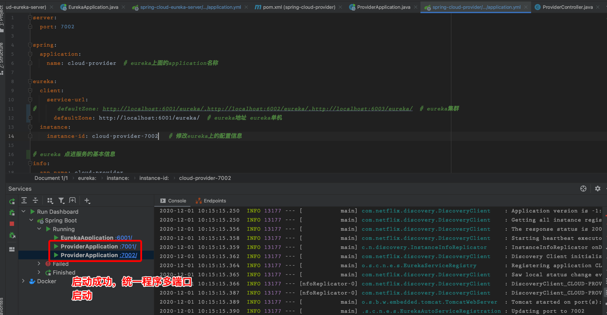

# spring-cloud-netflix-demo项目

## 搭建父级工程(maven)

- 父级项目spring-cloud-netfilx-demo
- 删除项目中的src目录，只留pom.xml
- 修改pom.xml 打包方式

```xml
<!--打包方式-->
<packaging>pom</packaging>
```

- 添加依赖管理

```xml
<!-- 版本管理-->
<properties>
    <spring.cloud.version>Hoxton.SR9</spring.cloud.version>
    <spring.boot.version>2.3.2.RELEASE</spring.boot.version>
    <lombok.version>1.18.16</lombok.version>
</properties>

<dependencyManagement>
    <dependencies>
        <!--spring-cloud-dependencies -->
        <dependency>
            <groupId>org.springframework.cloud</groupId>
            <artifactId>spring-cloud-dependencies</artifactId>
            <version>${spring.cloud.version}</version>
            <type>pom</type>
            <scope>import</scope>
        </dependency>
        <!--spring-boot-dependencies -->
        <dependency>
            <groupId>org.springframework.boot</groupId>
            <artifactId>spring-boot-dependencies</artifactId>
            <version>${spring.boot.version}</version>
            <type>pom</type>
            <scope>import</scope>
        </dependency>
        <dependency>
            <groupId>org.projectlombok</groupId>
            <artifactId>lombok</artifactId>
            <version>${lombok.version}</version>
        </dependency>

    </dependencies>
</dependencyManagement>
```

## Eureka

- 通过idea创建maven普通项目，springboot项目，module不会自动添加到父级项目中

- 项目名 spring-cloud-eureka-server

#### 一、添加eureka依赖 pom.xml


#### 二、配置

-  启动类配置

```java
/**
 * @author liouwb
 */
@SpringBootApplication
@EnableEurekaServer
public class EurekaApplication {
```

- application.yml配置

```yaml
server:
  port: 6001

eureka:
  instance:
    hostname: localhost-6003 # eureka服务端的实例名称
  client:
    register-with-eureka: false # 是否像服务注册中心注册自己
    fetch-registry: false # registry 为false，标识自己未注册中心
    service-url:
      # 单机配置
      defaultZone: http://${eureka.instance.hostname}:${server.port}/eureka/
      # 集群配置
#       defaultZone: http://localhost:6001/eureka/,http://localhost:6002/eureka/
```

#### 三、启动


- 访问eureka页面


## provider服务提供者

- 新建spring-cloud-provider项目

#### 添加依赖

```xml
<dependency>
    <groupId>org.springframework.boot</groupId>
    <artifactId>spring-boot-starter-web</artifactId>
</dependency>
<dependency>
    <groupId>org.springframework.cloud</groupId>
    <artifactId>spring-cloud-starter-netflix-eureka-client</artifactId>
</dependency>
```

#### 配置

- 启动类配置

```java
/**
 * @author liouwb
 */
@SpringBootApplication
@EnableEurekaClient
public class ProviderApplication {
```

- application.yml配置

```yaml
server:
  port: 7001

spring:
  application:
    name: cloud-provider  # eureka上面的application名称

eureka:
  client:
    service-url:
#      defaultZone: http://localhost:6001/eureka/,http://localhost:6002/eureka/,http://localhost:6003/eureka/  # eureka集群
      defaultZone: http://localhost:6001/eureka/  # eureka地址 eureka单机
  instance:
    instance-id: cloud-provider-7001   # 修改eureka上的配置信息

# eureka 点进服务的基本信息
info:
  app.name: cloud-provider
  company.name: com.liouwb
  build.artifactId: $project.artifactId$
  build.version: $project.verson$
```

- 编写测试接口


#### 启动服务

- 启动provider服务


- 访问eureka，可以看到服务已经注册上去了


- 访问provider服务


## idea同一个程序启动多个

- 修改配置


- 修改启动配置


- 启动服务



- 访问eureka查看


- 访问provider 7002和7001端口


## consumer服务

- 新建spring-cloud-consumer，客户端服务

#### 添加依赖

```xml
<dependency>
    <groupId>org.springframework.boot</groupId>
    <artifactId>spring-boot-starter-web</artifactId>
</dependency>
<dependency>
    <groupId>org.springframework.cloud</groupId>
    <artifactId>spring-cloud-starter-netflix-eureka-client</artifactId>
</dependency>
<dependency>
    <groupId>org.springframework.cloud</groupId>
    <artifactId>spring-cloud-starter-openfeign</artifactId>
</dependency>
<!--webflux-->
<dependency>
    <groupId>org.springframework.boot</groupId>
    <artifactId>spring-boot-starter-webflux</artifactId>
</dependency>
<!--hystrix-->
<dependency>
    <groupId>org.springframework.cloud</groupId>
    <artifactId>spring-cloud-starter-netflix-hystrix</artifactId>
</dependency>
<dependency>
    <groupId>org.springframework.boot</groupId>
    <artifactId>spring-boot-starter-actuator</artifactId>
</dependency>
```

#### 配置

- 启动类配置

```java
/**
 * @author liouwb
 */
@SpringBootApplication
@EnableEurekaClient
@EnableDiscoveryClient
@EnableFeignClients
public class ConsumerApplication {
```

- application.yml配置


#### 配置ribbon restTemplate webclient

- webclient


- restTemplate


- ribbon负载


#### 编写测试接口

```java
/**
 * @author liouwb
 */
@RestController
@RequestMapping("consumer")
public class ConsumerController {

    @Autowired
    private LoadBalancerClient loadBalancerClient;
    @Autowired
    private RestTemplate restTemplate;
    @Autowired
    private WebClient.Builder clientBuilder;
    @Autowired
    private ProviderService providerService;

    @GetMapping(value = "get")
    public String get() {

        return "这是一个服务";
    }

    /**
     * 调用provider服务 restTemplate
     *
     * @return
     */
    @GetMapping(value = "restProvider")
    public String restProvider() {
        //Access through the combination of LoadBalanceClient and RestTemplate
        // 发现服务
        ServiceInstance serviceInstance = loadBalancerClient.choose("cloud-provider");
        // 格式化请求路径
        String path = String.format("http://%s:%s/provider/get", serviceInstance.getHost(), serviceInstance.getPort());

        System.out.println("请求路径：" + path);

        return restTemplate.getForObject(path, String.class);
    }


    /**
     * 调用provider服务 webClientProvider
     *
     * @return
     */
    @GetMapping(value = "webClientProvider")
    public String webClientProvider() {

        return clientBuilder
                .baseUrl("http://cloud-provider/provider/get")
                .build()
                .method(HttpMethod.GET)
                .retrieve()//请求结果的方法
                .bodyToMono(String.class)
                .block();
    }
}
```

#### 启动

- 启动consumer服务


- 访问eureka，已经注册到eureka


- 访问consumer服务


## Hystrix 

- spring-cloud-provider添加Hystrix

#### 添加依赖

```xml
<dependency>
    <groupId>org.springframework.cloud</groupId>
    <artifactId>spring-cloud-starter-netflix-hystrix</artifactId>
</dependency>
```

#### 配置 开启Hystrix


#### 使用熔断


#### 重启provider 7001和7002端口服务

- 测试


## 网关 zuul

- 新建spring-cloud-zuul项目

#### 添加依赖

```xml
<dependency>
    <groupId>org.springframework.boot</groupId>
    <artifactId>spring-boot-starter-web</artifactId>
</dependency>
<dependency>
    <groupId>org.springframework.cloud</groupId>
    <artifactId>spring-cloud-starter-netflix-eureka-client</artifactId>
</dependency>
<dependency>
    <groupId>org.springframework.cloud</groupId>
    <artifactId>spring-cloud-starter-netflix-hystrix</artifactId>
</dependency>
<dependency>
    <groupId>org.springframework.boot</groupId>
    <artifactId>spring-boot-starter-actuator</artifactId>
</dependency>
<dependency>
    <groupId>org.springframework.cloud</groupId>
    <artifactId>spring-cloud-starter-netflix-zuul</artifactId>
</dependency>
```

#### 编写配置

- 启动类

```
/**
 * @author liouwb
 */
@SpringBootApplication
@EnableZuulProxy
public class ZuulApplication {
```

- application.yml配置文件


#### 启动zuul服务


- 访问eureka，zuul已经注册到eureka中


- 通过zuul规则访问


## Eureka集群配置(3台为例)

- 修改application.yml配置


- 然后启动，其他两台同样的操作


- 启动三台eureka服务


- 分别访问localhost:6001 localhost:6002 localhost:6003


#### provider服务，像eureka集群注册服务

- 修改eureka注册地址为集群，多个地址逗号分隔


- 启动provider服务


- 访问eureka,每台eureka注册都有provider服务


- 访问provider服务，正常


